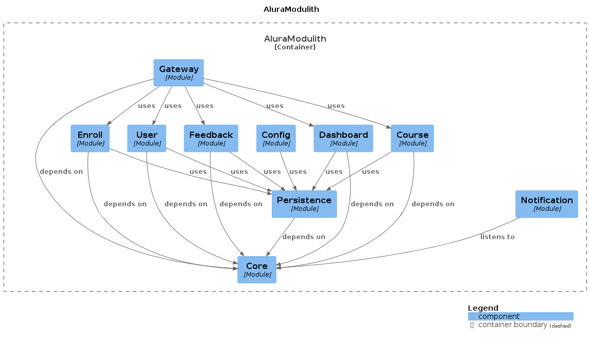

### Course manager

Uses:
- Spring Security.
- Postgres as main DB.
- H2 as test DB.
- Flyway to migrations.
- Modulith to turn it into a modular monolith kind.
- Lombok.
- Open telemetry with zipkin to simple observability.
- Swagger to api docs.

### How to run

You can emulate a production service with:

```bash
sudo docker-compose -f docker-compose-with-app.yml up
```

It will start a postgresl db acessible in 5434 along with a dockerfile for the app.

You can see api endpoints in [/swagger-ui/index.html](http://localhost:8081/swagger-ui/index.html)

### How to run - developer mode

Use the command below to start database:

```bash
sudo docker-compose up
```

Now you can execute the app:

```bash
## youll need jdk 21 configured
./mvnw clean install -DskipTests
./mvnw spring-boot:run
```

### Default User

```bash
username=teste
password=teste
```

### Module distribution



### Tests

Till now ive created only integration tests using the api enpoints to validate business rules and security authentication based on roles.

It tests almost the full app.

### Disclaimer

Its the first service that i've created from zero using spring boot, so all the techs like moduliths, security or even configurations and dockerization is something that i did based on my experiences with quarkus.